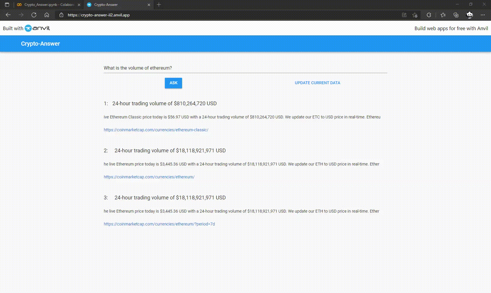

## Install our system ##

All of the tools are free to use. 
In order to use our app you need a google account. 
The google account is required to upload a notebook to [Google Colab](https://colab.research.google.com/). We also use [Google Drive](http://drive.google.com/) to permanently store the file for our annotated data (see "Installation").
To create our website we used [Anvil](https://anvil.works/). It is **NOT** required to have an Anvil account to use our website.

#### Installation ####

To test our system Crypto-Answer please follow **[these](./docs/Installation-instructions.md)** instructions.

#### Instructions ####

- Follow the [installation instructions](./docs/Installation-instructions.md) from before
- Enable GPU runtime in your google colab notebook
- Run all cells from top to bottom (**follow instructions at code cell 3 to mount to google drive** for fine-tuning)
- Our [website](https://crypto-answer-il2.anvil.app/) can be used **only after all cells were executed**

## Crypto-Answer Architecture ##

Crypto-Answer is a Question-Answering (QA) system for cryptocurrency based on [Haystack](https://github.com/deepset-ai/haystack/).
We fine-tuned the roberta-base-squad2 model from [Huggingface](https://huggingface.co/deepset/roberta-base-squad2) and used Haystack's [Webcrawler](https://haystack.deepset.ai/usage/preprocessing) to create our document collection. Additionally we created a customized Pipeline with a combination of the Dense Passage Retriever and Elasticsearch Retriever.
To test our QA-system Crypto-Answer we created a Website with [Anvil](https://anvil.works/docs/uplink/quickstart).
The Website includes two functions, the running of a query ("ASK") and an update of the data for real time information on cryptocurrencies ("UPDATE CURRENT DATA").

## Webcrawler ##

The Webcrawler as an illustration:

## Website ##

An Overview of our Website created with [Anvil](https://anvil.works/docs/uplink/quickstart):

## Evaluation ##

#### Results ####

We used probands to create a [Ground Truth](./docs/Ground-Truth.md) of 100 gold-standard question-answer pairs.

With the Ground truth we calculated the exact match values. An answer was classified as an exact match, if it included the gold-standard answer precisely.

For the [answer distribution](./docs/answer-distribution.md), the probands had to assess if the answers returned by our QA-system to their questions, satisfied their information need and at what rank.

In total we calculated the exact match values, the answer distribution, the top-n-accuracy as well as the Mean reciprocal rank of our QA-systems paired with different settings for the reader and retriever. All metrics can be viewed **[here](./docs/metrics.md)**.

## Libraries & Tools ##

For our Question-Answering system a combination of libraries is required. The libraries are free to use and automatically downloaded and installed in our Google Colab notebook. Libraries and tools include:
- [Haystack](https://github.com/deepset-ai/haystack/) with these tools:
  - [PreProcessor](https://haystack.deepset.ai/usage/preprocessing)
  - [DocumentStore](https://haystack.deepset.ai/usage/document-store)
  - [Retriever](https://haystack.deepset.ai/usage/retriever)
  - [FARMReader](https://haystack.deepset.ai/usage/reader)
  - [Pipeline](https://haystack.deepset.ai/usage/pipelines)
  - [Webcrawler](https://haystack.deepset.ai/usage/preprocessing)
- [Haystack's Annotation Tool](https://annotate.deepset.ai)
- [Huggingface](https://huggingface.co/deepset/roberta-base-squad2)
- [Anvil](https://anvil.works/)
  - [Anvil Server](https://anvil.works/docs/uplink/quickstart)
