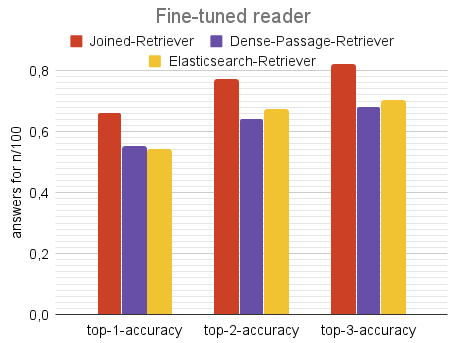

# Metrics

We evaluated which settings for the reader and retriever return the best results.

We fine-tuned our reader on our own data created with Haystack's [Annotation tool](https://haystack.deepset.ai/guides/annotation).
Following we compared the default reader with the fine-tuned version.
Additionally we used three different retriever in combination with the default and fine-tuned reader to determine which delivers the best performance, including the Dense Passage Retriever, the Elasticsearch Retriever and a joined Version of both retrievers.

### 1.  Answer Distribution for the default and fine-tuned reader

 

### 2.  Top-n-accuracies for the default and fine-tuned reader

 

### 3.  Mean Reciprocal Rank for the default and fine-tuned reader

 

### 4.  Exact match values for the default and fine-tuned reader

 

